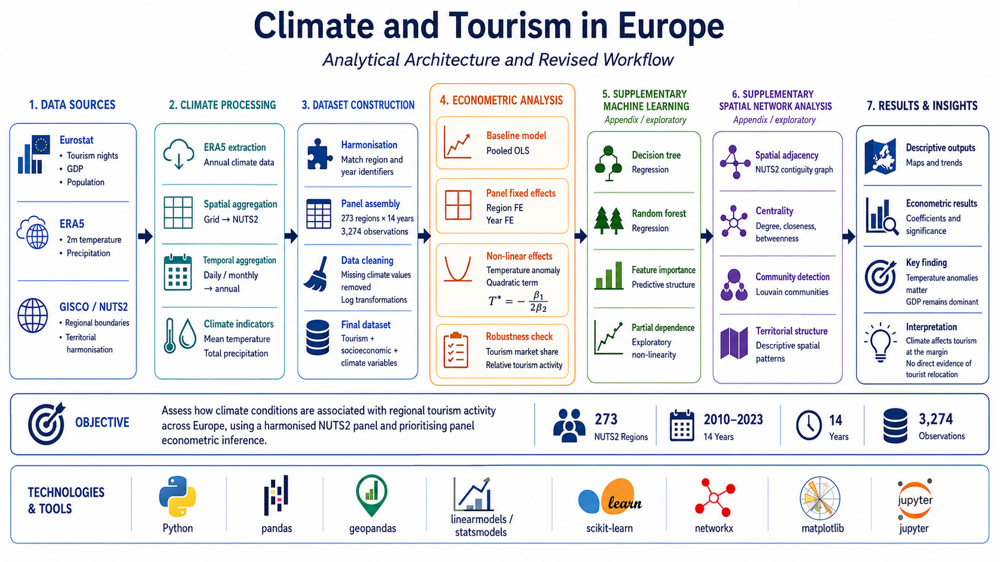

# Climate and Tourism in Europe

Computational social science project analysing the relationship between climate conditions and regional tourism activity across European NUTS2 regions.

The project builds a harmonised regional panel dataset for the period **2010–2023**, combining Eurostat tourism indicators, ERA5 climate data, regional socioeconomic variables, and NUTS2 geographic boundaries.

The main empirical contribution relies on **panel econometric models**. Machine learning and spatial network analysis are included as **supplementary exploratory analyses** to provide additional descriptive insights into predictive patterns, non-linearities, and territorial structures.

---

## Architecture



End-to-end analytical workflow integrating data acquisition, climate processing, territorial harmonisation, panel dataset construction, econometric modelling, supplementary machine learning, exploratory spatial network analysis, and final interpretation.

---

## Overview

This project investigates the relationship between climate conditions and tourism activity across European regions at the NUTS2 level.

The analysis focuses on the following question:

> What is the relationship between climate conditions and tourism activity across European regions over time?

A secondary motivation is to assess whether rising temperatures are associated with a relative shift in tourism activity toward cooler European regions. However, the project does **not** directly observe tourist mobility flows. The results are therefore interpreted as associations between climate conditions and regional tourism intensity, not as direct evidence of tourist relocation.

The project adopts an observational and non-causal perspective, focusing on robust statistical relationships rather than causal identification.

---

## Research Design

The core empirical strategy is based on panel econometric models.

The analysis combines:

* pooled OLS models,
* year fixed effects,
* region fixed effects,
* temperature anomaly specifications,
* quadratic temperature terms,
* robustness checks using tourism market share.

Machine learning and spatial network analysis are used as exploratory extensions and are reported as supplementary evidence.

---

## Data Sources

### Eurostat

Regional tourism and socioeconomic indicators:

* Tourism nights
* Gross domestic product (GDP)
* Population

### ERA5 Climate Data

Climate indicators:

* 2m temperature
* Total precipitation

ERA5 climate data are processed and spatially aggregated to NUTS2 regions.

### GISCO / NUTS2

Geographic boundaries used for:

* territorial harmonisation,
* spatial aggregation,
* regional matching,
* adjacency network construction.

---

## Final Dataset

Final harmonised panel dataset:

* **273 NUTS2 regions**
* **34 European countries**
* **2010–2023**
* **14 years**
* **3,274 observations**
* unbalanced panel
* coverage ratio of approximately **85.7%**

Dataset available in:

```text
data/processed/final_dataset_nuts2_2010_2023.csv
```

Raw ERA5 files are not fully included due to storage constraints.

---

## Analytical Workflow

### 01 — Data Import

Notebook:

```text
code/01_data_import.ipynb
```

Purpose:

* import Eurostat tourism indicators,
* import GDP data,
* import population data,
* prepare regional and temporal identifiers.

Main outputs:

* cleaned tourism data,
* cleaned GDP data,
* cleaned population data.

---

### 02 — Climate Processing

Notebook:

```text
code/02_climate_processing.ipynb
```

Purpose:

* extract ERA5 climate information,
* process temperature and precipitation variables,
* aggregate climate data to annual values,
* spatially match gridded climate observations to NUTS2 regions.

Main outputs:

* annual regional temperature indicators,
* annual regional precipitation indicators,
* climate dataset matched to NUTS2 regions.

---

### 03 — Dataset Construction

Notebook:

```text
code/03_build_dataset.ipynb
```

Purpose:

* merge tourism, GDP, population, and climate data,
* harmonise region-year identifiers,
* remove missing climate observations,
* construct the final panel dataset,
* create transformed variables.

Main variables:

* `tourism_nights`
* `gdp`
* `population`
* `temperature`
* `precipitation`
* `log_tourism`
* `log_gdp`
* `log_pop`
* `temp_anomaly`
* `temp_sq`
* `tourism_share`
* `log_share`

Main output:

```text
data/processed/final_dataset_nuts2_2010_2023.csv
```

---

### 04 — Econometric Analysis

Notebook:

```text
code/04_regression.ipynb
```

Purpose:

* estimate baseline OLS models,
* estimate panel fixed effects models,
* analyse within-region climate variation,
* test non-linear temperature effects,
* compute the implied temperature turning point,
* assess robustness using tourism market share.

Core models:

* OLS with time fixed effects,
* region and year fixed effects,
* non-linear fixed effects specification,
* robustness check with `log_share`.

Main interpretation:

* temperature anomalies are positively associated with tourism activity within regions;
* precipitation does not show a robust relationship once regional heterogeneity is controlled for;
* non-linear specifications suggest an inverted U-shaped relationship;
* GDP remains the dominant structural factor in cross-sectional variation.

---

### 05 — Supplementary Machine Learning Analysis

Notebook:

```text
code/05_machine_learning.ipynb
```

Purpose:

* provide exploratory predictive evidence,
* examine non-linear patterns,
* compare flexible predictive models with econometric results.

Models:

* Decision Tree Regressor
* Random Forest Regressor

Outputs:

* decision tree segmentation,
* random forest performance,
* feature importance,
* partial dependence plots.

Interpretation:

Machine learning results are treated as supplementary and descriptive. They mainly capture broader cross-sectional predictive patterns, especially the dominance of GDP, rather than replacing the panel econometric analysis.

---

### 06 — Supplementary Spatial Network Analysis

Notebook:

```text
code/06_network_analysis.ipynb
```

Purpose:

* construct a NUTS2 spatial adjacency network,
* analyse territorial connectivity,
* compute network centrality measures,
* detect spatial communities.

Network definition:

* nodes = NUTS2 regions,
* edges = shared borders between neighbouring regions.

Main outputs:

* degree centrality,
* closeness centrality,
* betweenness centrality,
* Louvain communities,
* spatial community maps.

Interpretation:

The network analysis is exploratory. It represents geographic adjacency, not tourist mobility flows, transport networks, or economic interactions.

---

## Econometric Framework

The baseline specification relates regional tourism activity to climate and socioeconomic variables:

```text
log(Tourism) ~ Temperature + Precipitation + log(GDP) + log(Population) + Year FE
```

The fixed effects specification controls for unobserved regional heterogeneity:

```text
log(Tourism) ~ Temperature anomaly + Precipitation + Region FE + Year FE
```

The non-linear specification introduces a quadratic temperature anomaly term:

```text
log(Tourism) ~ Temp anomaly + Temp anomaly² + Precipitation + Region FE + Year FE
```

The implied turning point is computed as:

```text
T* = -β1 / (2β2)
```

A robustness check uses tourism market share:

```text
Share(region, year) = Tourism(region, year) / Total Tourism(year)
```

This alternative dependent variable tests whether results depend on absolute tourism volumes or relative regional tourism performance.

---

## Main Findings

The main findings are:

* Temperature anomalies are positively associated with regional tourism activity.
* A one-degree increase relative to usual regional conditions is associated with an increase of approximately 17% in tourism activity in the fixed-effects specification.
* Precipitation does not display a robust relationship once regional heterogeneity is controlled for.
* The non-linear econometric model suggests an inverted U-shaped relationship between temperature anomalies and tourism activity.
* The estimated turning point is approximately +0.56°C relative to the regional mean.
* GDP remains the dominant structural predictor of tourism activity across regions.
* Tourism market share robustness checks produce equivalent conclusions under year fixed effects.
* The analysis does not provide strong evidence of a systematic shift in tourism demand toward cooler European regions.
* Machine learning and network analyses provide useful descriptive insights but are not the primary basis for inference.

Overall, climate conditions matter for tourism, but mainly at the margin. Structural economic and regional factors remain central in explaining tourism patterns across Europe.

---

## Results

Outputs are available in:

```text
results/
```

Main result files include:

```text
betweenness_map.png
centrality_tourism.png
community_map.png
hist_tourism.png
map_temperature.png
map_tourism.png
nonlinear_effect.png
pdp.png
temp_trend.png
tree.png
Project_Overview.png
```

These outputs include:

* tourism distribution plots,
* climate maps,
* tourism maps,
* temperature trend plots,
* regression visualisations,
* non-linear effect plots,
* decision tree outputs,
* partial dependence plots,
* network centrality maps,
* community detection maps.

---

## Paper

The final paper is available in:

```text
paper/paper.pdf
```

The paper presents:

* the theoretical background,
* research problem,
* data construction,
* operationalisation,
* econometric strategy,
* empirical results,
* limitations,
* discussion and conclusion,
* supplementary machine learning and network analyses.

---

## Project Structure

```text
CSS_Tourism/
│
├── code/
│   ├── 01_data_import.ipynb
│   ├── 02_climate_processing.ipynb
│   ├── 03_build_dataset.ipynb
│   ├── 04_regression.ipynb
│   ├── 05_machine_learning.ipynb
│   └── 06_network_analysis.ipynb
│
├── data/
│   ├── processed/
│   │   └── final_dataset_nuts2_2010_2023.csv
│   │
│   └── raw/
│       ├── era5_2010_2023_extracted/
│       ├── NUTS_RG_01M_2021_4326/
│       ├── era5_2010_2023.nc
│       ├── gdp.csv
│       ├── population.csv
│       └── tourism.csv
│
├── paper/
│   └── paper.pdf
│
├── results/
│   ├── betweenness_map.png
│   ├── centrality_tourism.png
│   ├── community_map.png
│   ├── hist_tourism.png
│   ├── map_temperature.png
│   ├── map_tourism.png
│   ├── nonlinear_effect.png
│   ├── pdp.png
│   ├── temp_trend.png
│   ├── tree.png
│   └── Project_Overview.png
│
├── README.md
├── requirements.txt
└── .gitignore
```

---

## Reproducibility

### Create virtual environment

```bash
python -m venv .venv
```

### Activate virtual environment

```bash
# Windows
.venv\Scripts\activate

# Linux / macOS
source .venv/bin/activate
```

### Install dependencies

```bash
pip install -r requirements.txt
```

---

## Run Analytical Pipeline

Start Jupyter:

```bash
jupyter notebook
```

Then execute notebooks sequentially:

```text
1. code/01_data_import.ipynb
2. code/02_climate_processing.ipynb
3. code/03_build_dataset.ipynb
4. code/04_regression.ipynb
5. code/05_machine_learning.ipynb
6. code/06_network_analysis.ipynb
```

The recommended order is important because later notebooks depend on outputs generated in earlier stages.

---

## Technologies Used

* Python
* pandas
* geopandas
* xarray
* statsmodels
* linearmodels
* scikit-learn
* networkx
* matplotlib
* Jupyter Notebook
* Eurostat data
* ERA5 climate data
* GISCO NUTS2 boundaries

---

## Limitations

The project remains observational and non-causal.

Main limitations include:

* absence of direct tourist origin-destination flow data,
* annual aggregation of tourism and climate variables,
* limited ability to capture seasonal tourism dynamics,
* potential omitted variables such as infrastructure, accessibility, accommodation capacity, and tourism specialisation,
* spatial aggregation of climate data to NUTS2 regions,
* unbalanced panel structure,
* exploratory status of machine learning and network analyses,
* simplified territorial adjacency assumptions in the spatial network.

The results should therefore be interpreted as associations between climate conditions and regional tourism intensity, not as causal estimates or direct evidence of tourist relocation.

---

## Future Work

Potential future extensions include:

* origin-destination tourism flow analysis,
* seasonal or monthly climate-tourism modelling,
* richer tourism indicators,
* accommodation capacity controls,
* transport accessibility indicators,
* spatial econometric models,
* quasi-experimental identification strategies,
* dynamic analysis of regional tourism adaptation.

---

## Author

Henri Vasserot
MSc Data Science — University of Trento
Computational Social Science [145680]
Instructor: Campedelli